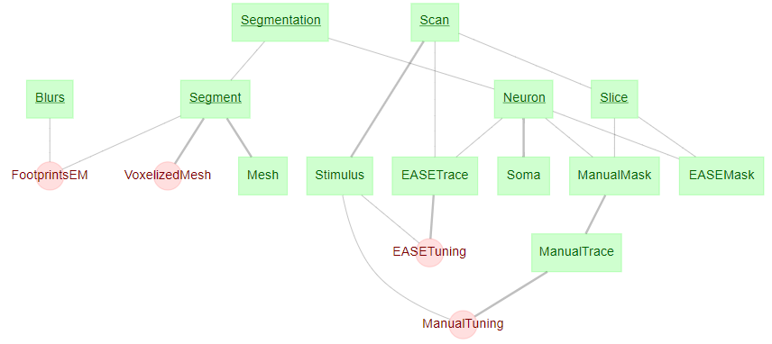

# DataJoint - Seung Lab
Datajoint schemas provided by Seung Lab.

### Installation
DataJoint for Python requires Python 3.4 or above to function properly.
```
pip3 install datajoint
```
For more information, please checkout the [DataJoint Tutorials](https://tutorials.datajoint.io/setting-up/datajoint-python.html).  

### DataJoint database
### Database configuration
#### Public database
- HOST: datajoint.ninai.org
- USER: Given after registration
- PASSWORD: Given after registration

You need to be registered to access the database. Please fill out the [registration form](https://forms.gle/6SeDGRT8zoLqpbfU9) to receive user id and password.

#### Local database
Database location: Princeton Neuroscience Institute, Princeton University

- HOST: seungdj01.princeton.edu
- USER: Your Princeton net id (ex. jabae)
- PASSWORD: Your Princeton net id password

*You have to be affiliated with Princeton University to access the database.

### Accessing the database
```python3
import datajoint as dj

# Datajoint credentials
dj.config["database.host"] = "seungdj01.princeton.edu"

dj.conn() # Then it will ask for your net id and password
```

or

```python3
dj.config.load("dj_conf.json")

dj.conn()
```

<details> <summary> dj_conf.json </summary>
  
```python3
{
    "database.host": "seungdj01.princeton.edu", 
    "database.password": "your_netid_password", # THIS IS OPTIONAL. If you don't specify it here, it will ask for it when you connect to the database (dj.conn())
    "database.user": "your_netid", # THIS IS OPTIONAL. If you don't specify it here, it will ask for it when you connect to the database (dj.conn())
    "database.port": 3306,
    "database.reconnect": true,
    "connection.init_function": null,
    "connection.charset": "",
    "loglevel": "INFO",
    "safemode": true,
    "fetch_format": "array",
    "display.limit": 50,
    "display.width": 25,
    "display.show_tuple_count": true,
    "history": [
    ]
}
```
</details>

## Pinky
```
pinky = dj.create_virtual_module("Seung_pinky", "Seung_pinky")
```

### Schema ERD

