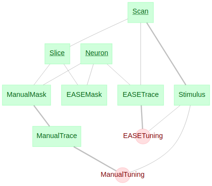

# datajoint_seung
Datajoint databases in Seung Lab.

## Database configuration
Database location: Princeton Neuroscience Institute, Princeton University

- HOST: seungdj01.princeton.edu
- USER: Your Princeton net id (ex. jabae)
- PASSWORD: Your Princeton net id password

*You have to be affiliated with Princeton University to access the database.

### Accessing the database
```python3
import datajoint as dj

# Datajoint credentials
dj.config["database.host"] = "seungdj01.princeton.edu"
dj.config["database.user"] = "your_netid"
dj.config["database.password"] = "your_netid_pw"

dj.conn()
```

or

```python3
dj.config.load("dj_conf.json")

dj.conn()
```

#### dj_conf.json
```
{
    "database.host": "seungdj01.princeton.edu", 
    "database.password": "your_netid_password", # Need to edit
    "database.user": "your_netid", # Need to edit
    "database.port": 3306,
    "database.reconnect": true,
    "connection.init_function": null,
    "connection.charset": "",
    "loglevel": "INFO",
    "safemode": true,
    "fetch_format": "array",
    "display.limit": 50,
    "display.width": 25,
    "display.show_tuple_count": true,
    "history": [
    ]
}
```

## Pinky40
### Schema ERD


### Tables
- Scan: Scan information of functional scans Baylor recorded. Total of 9 scans exist.
    - `scan_id`: Scan id ([2,3,4,5,6,9,10,11,12]).
    - `depth`: z index in the 2p structural stack (0 ~ 330).
    - `laser_power`: Laser power.
    - `wavelength`: Wavelength.
    
- Slice: Slice information of functional scans. 3 slices exist for each scan.
    - `scan_id`: Scan id of the slice.
    - `slice_idx`: Slice index within each scan ([1,2,3]).
    - `depth`: z index in the 2p structural stack (0 ~ 330).
    
- Stimulus: Visual stimulus used for the functional recording. The slices in each scan are recorded simultaneously.
    - `scan_id`: Scan id.
    - `movie`: Visual stimulus (90 x 160 x 27100 array). Time resolution is 14.83 frame/s. 
    - `condition`: Angle of the visual stimulus (length 27100 vector). Angles range between 0&deg; and 360&deg; with resolution of 22.5&deg;. The directions of the stimulus is pseudorandomly-ordered.
    
- Neuron: Cells in pinky40.
    - `segment_id`: Segment id in `gs://neuroglancer/pinky40_v11/watershed_mst_smc_sem5_remap`
    - `manual_id`: Id of manual masks drawn by Jake.
    - `ease_id`: Segment id from the EASE result.
    
- ManualMask: Manual masks.

- ManualTrace: Traces from manual masks.

- ManualTuning: Tuning curve computed from manual trace.

- EASEMask: EASE masks.

- EASETrace: Traces from EASE masks.

- EASETuning: Tuning curve computed from EASE trace.

## Pinky
### Schema ERD


### Tables
- Scan: Scan information of functional scans Baylor recorded. Total of 9 scans exist.
    - `scan_id`: Scan id ([2,3,4,5,6,9,10,11,12]).
    - `depth`: z index in the 2p structural stack (0 ~ 330).
    - `laser_power`: Laser power.
    - `wavelength`: Wavelength.
    
- Slice: Slice information of functional scans. 3 slices exist for each scan.
    - `scan_id`: Scan id of the slice.
    - `slice_idx`: Slice index within each scan ([1,2,3]).
    - `depth`: z index in the 2p structural stack (0 ~ 330).
    
- Stimulus: Visual stimulus used for the functional recording. The slices in each scan are recorded simultaneously.
    - `scan_id`: Scan id.
    - `movie`: Visual stimulus (90 x 160 x 27100 array). Time resolution is 14.83 frame/s. 
    - `condition`: Angle of the visual stimulus (length 27100 vector). Angles range between 0&deg; and 360&deg; with resolution of 22.5&deg;. The directions of the stimulus is pseudorandomly-ordered.
    
- Neuron: Cells in pinky100.
    - `segment_id`: Segment id in materialization `v179`.
    - `manual_id`: Id of manual masks drawn by Jake.
    
- ManualMask: Manual masks.

- ManualTrace: Traces from manual masks.

- ManualTuning: Tuning curve computed from manual trace.

- EASEMask: EASE masks.

- EASETrace: Traces from EASE masks.

- EASETuning: Tuning curve computed from EASE trace.

- Segment: Segments with 10 or more synapses in pinky100.
    - `segment_id`: Segment id in materialization `v179`.
    - `manual_id`: Id of manual masks.

- Mesh: Meshes of segments.
    - `n_vertices`: Number of vertices.
    - `n_triangles`: Number of triangles.
    - `vertices`: Mesh vertices [nm].
    - `triangles`: Triangle connectivity (python indexing).
